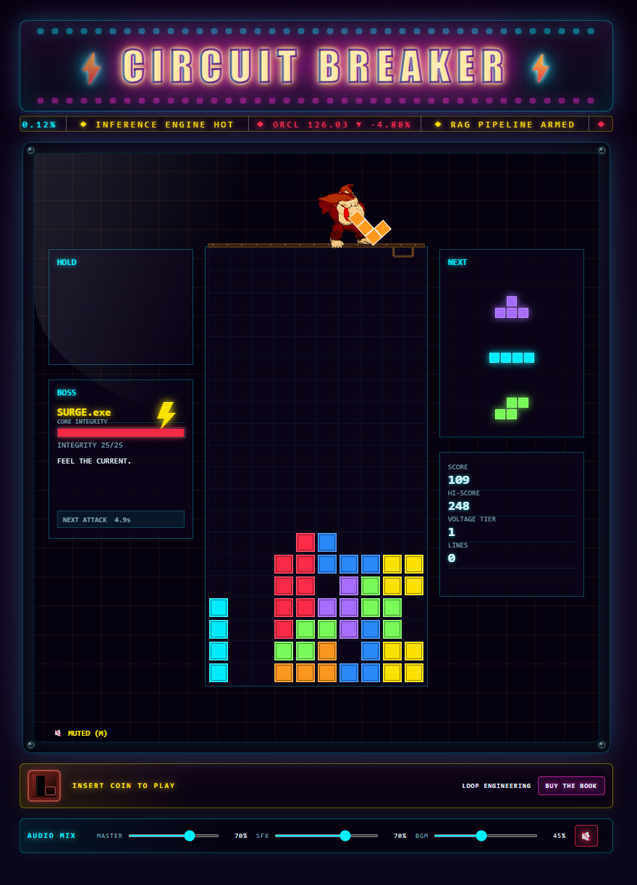

# ⚡ CIRCUIT BREAKER ⚡

> **HIGH VOLTAGE BLOCK STACKER** · **BOSS RUSH PROTOCOL** · **TRIP THE MAINFRAME**

<p align="center">
  
</p>

[](https://cb.correax.com)


*A high-voltage cyberpunk arcade **remix** — the falling blocks of Tetris,
the girder-perched gorilla hurling them down from a Donkey Kong-style
construction site, a **Boss Rush** mode where roaming Pac-Man-shaped
attackers chew through your stack, and a live AI-basket stock ticker
running across the marquee. Build the stack. Break the circuit.
Take down the mainframe.*

---

## ⚡ The concept

Three arcade DNA strands wired into one cabinet, with a fourth wire pulled
from somewhere far weirder:

- **Tetris** provides the core loop — a well, seven tetrominoes, gravity, and
  the pursuit of the line clear. Everything modern players expect is in the
  box: Super Rotation System, wall kicks, hold, ghost preview, a 7-bag
  randomiser, and hard drops.
- **Donkey Kong** supplies the *stage director*. A cartoon gorilla climbs an
  animated ladder onto the girder above the well at the start of every run,
  beats his chest, then paces back and forth **throwing each new piece down
  into the column he happens to be over**. Every run's column pressure is
  slightly different — the RNG has a face and a wind-up animation.
- **Pac-Man** shows up when you clear lines. Cleared rows summon glowing
  chomping Pacmen that streak across the well behind an RGB-split pellet
  trail; a Tetris (four-line clear) summons a giant *MAIN BREAKER* Pacman
  with foreground lightning. In Boss Rush, hostile Pacmen also appear as
  roaming attackers on the higher tiers.
- **A live stock ticker** rides the cabinet marquee — real indicative quotes
  for an AI-focused basket (`MSFT`, `NVDA`, `GOOGL`, `AMZN`, `META`, `AMD`,
  `AVGO`, `ORCL`, `PLTR`, `TSM`) interleaved with arcade phrases like
  *"◆ TOKEN BUDGET CRITICAL"* and *"◆ INFERENCE ENGINE HOT"*. It's the
  Bloomberg terminal that grew up watching *Tron*, and it gives the cabinet
  the exact mood of a trading floor about to trip a breaker.

The cabinet chrome, CRT scanlines, synthwave BGM, and animated marquee are
there to sell the illusion that you cracked open a rogue arcade machine at
2 a.m. and it's already running.

---

## ⚡ Play

Live in a browser near you: **[cb.correax.com](https://cb.correax.com)**

Or run it locally:

```bash
npm install
npm run dev # http://localhost:5173
```

Ship a static bundle:

```bash
npm run build # dist/
npm run preview
```

## 🎮 Controls

| Key           | Action          |
|---------------|-----------------|
| ← / →         | Move            |
| ↓             | Soft drop       |
| Space         | Hard drop       |
| ↑ / X         | Rotate CW       |
| Z             | Rotate CCW      |
| Shift / C     | Hold piece      |
| P             | Pause / resume  |
| M             | Mute audio      |
| R             | Restart run     |

Click or press any key to boot the cabinet. The browser requires a user gesture
before it can start the audio graph.

## 🕹️ Features

### Modern block-stacker fundamentals

Nothing that would surprise a competitive Tetris player. Rotation, kick tables,
and the randomiser all match modern conventions so muscle memory transfers
cleanly from Tetr.io / Jstris:

- Seven tetrominoes with full **SRS rotation + wall-kick tables** for JLSTZ and I
- **7-bag randomizer**, one-swap-per-drop hold, ghost preview, and next-three queue
- **AMPERAGE xN** combo tracker, boss-driven voltage tiers and gravity, and a local high score

### Kong on the girder

Every run opens with Kong climbing a rusty I-beam ladder that animates down
from the top of the cabinet, retracts to a stub once he's on the girder, and
then he beats his chest before starting to pace. From that point on he owns
the spawn point:

- He paces the full board width with an organic wander (no ping-pong pattern)
- Every new piece plays a **wind-up → release** animation with the tetromino
  visibly arcing from his hand into the well
- Whichever column he's over when he throws is where the piece spawns — so
  drift matters, and you learn to read his facing direction
- He goes silent and still when you pause (**P**) so you can screenshot the
  throw mid-flight

### Boss Rush

Five rogue AIs stand between you and the mainframe. Each fight tracks
**BOSS INTEGRITY** on a dedicated HP bar; the BGM drops to a frantic
*boss-low* mix under 25% HP, and defeating one advances the **VOLTAGE TIER**
plus gravity curve:

1. **SURGE.exe** -- the warm-up, occasional voltage spikes
2. **BLACKOUT** -- hides your NEXT preview at random intervals
3. **SHORTFUSE** -- dumps garbage lines when you dawdle
4. **FEEDBACK LOOP** -- scrambles columns
5. **THE MAINFRAME** -- every attack, twice as fast

### Audio (100% procedural, no assets)

The soundtrack is generated at runtime from a Web Audio graph — no MP3s, no
sample libraries. That keeps the download tiny and every session slightly
different:

- Web Audio graph with reverb send/return bus + master DynamicsCompressor
- Synthwave sequencer: chord progressions, detuned-saw lead, ambient pad, real drum kit
- Punchy layered SFX: hard-drop sub boom, chromatic line-clear zaps, tetris BOOM with fanfare stab
- Persisted master, SFX, and BGM mixer controls plus `M` mute shortcut

### The look

Every visual effect is drawn in Canvas 2D — there are no SVG overlays or
external image effects. That means everything scales cleanly and stays in
sync with the game clock:

- Circuit-trace animated background, CRT scanlines, screen shake, chromatic flash
- **Neon Pacman line clear** -- one chomping cyberpunk Pacman per cleared row, alternating direction, RGB split, and glowing pellet trail; a Tetris summons a giant breaker Pacman with foreground lightning arcs
- `MAIN BREAKER TRIPPED` four-line-clear banner, circuit lightning, particles, screen shake, and chromatic flash
- A large top-layer Grid Wraith roams the board briefly when a run ends, then dissolves into the cabinet glow
- Indicative quotes for an AI-focused basket alternate with arcade phrases in the ticker crawl
- The cabinet's `INSERT COIN` slot links to *Loop Engineering* on Amazon
- Responsive arcade cabinet chrome with animated marquee, occasional blinking lights, scrolling ticker, bezel reflection, and corner screws

### Ticker and privacy

The market ticker at the top of the cabinet is real data with no tracking
attached — the client only ever talks to our own first-party endpoint, and
that endpoint is aggressively cached:

- The browser calls only the first-party `/api/quotes` endpoint; it never contacts the quote provider directly.
- The server returns indicative quotes for `MSFT`, `NVDA`, `GOOGL`, `AMZN`, `META`, `AMD`, `AVGO`, `ORCL`, `PLTR`, and `TSM`, with a five-minute server cache, a short browser/edge cache, and bounded retries.
- If quote retrieval fails, the ticker continues with arcade phrases and gameplay remains unaffected.
- Ticker values and interaction are not tracked. The Amazon purchase link is not tracked either.

## 🛠️ Tech

Built with an unfashionably small stack for a game that leans this hard on
visual and audio effects:

- **TypeScript** (strict) + **HTML5 Canvas 2D** + **Web Audio API**
- **Vite** for dev / build (about 49 KB JavaScript, about 15 KB gzipped)
- **Zero runtime dependencies**
- Deployed on **Azure Static Web Apps** (Standard tier, custom domain w/ managed TLS)

The whole client fits comfortably under an idle tab's memory budget and boots
faster than the first synth pad note — the audio graph is what needs the user
gesture, not the render loop.

## 📂 Project layout

```text
src/
├── main.ts           # boot, game loop, wiring
├── game.ts           # phase machine, scoring, boss orchestration
├── board.ts          # grid + line-clear
├── piece.ts          # tetromino shapes, SRS wall-kicks, 7-bag
├── bosses.ts         # boss definitions and attack patterns
├── effects.ts        # particles, lightning, announcements, Pacman runs
├── renderer.ts       # canvas draw pipeline
├── input.ts          # keyboard + DAS/ARR
├── market-ticker.ts  # arcade phrase and indicative quote ticker
├── audio/
│   ├── audio.ts      # graph, mixer persistence, reverb bus, compressor
│   ├── music.ts      # synthwave sequencer
│   └── sfx.ts        # procedural SFX bank
└── ...

api/
├── src/quotes.js      # cached, bounded-concurrency indicative quote adapter
└── src/functions/     # Azure Functions v4 quote endpoint
```

## 🚀 Deploy

The live site uses Azure Static Web Apps. A push to `main` runs typecheck, tests,
production build, artifact validation, and deployment through
`.github/workflows/azure-static-web-apps.yml`.

Pull requests deploy tracker-disabled preview environments. Production pushes set
`CB_TRACKER_ENABLED=true` so only the default environment emits page views.

Run the complete local gate before a release:

```bash
npm run check
```

For emergency recovery when GitHub Actions is unavailable:

```bash
npm run build
npx @azure/static-web-apps-cli deploy ./dist \
  --deployment-token $env:SWA_TOKEN \
  --env production
```

The manual command is a recovery path, not the normal release process.

## 📜 License

MIT -- hack it, remix it, ship your own arcade cabinet.

Third-party art assets (currently: the Kong sprite sheet) are credited
separately in [CREDITS.md](CREDITS.md). Please preserve those attributions
if you fork the game.
