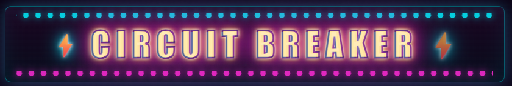

<p align="center">
  
</p>

<p align="center">
  <a href="https://cb.correax.com">
    
  </a>
  
  
</p>

<p align="center">
  <em>A high-voltage cyberpunk block-stacker with <b>Boss Rush</b> mode.<br/>
  Stack the current. Trip the mainframe.</em>
</p>

---

## ⚡ Play

Live in a browser near you: **[cb.correax.com](https://cb.correax.com)**

Or run it locally:

```bash
npm install
npm run dev          # http://localhost:5173
```

Ship a static bundle:

```bash
npm run build        # → dist/
npm run preview
```

## 🎮 Controls

| Key           | Action          |
|---------------|-----------------|
| ← / →         | Move            |
| ↓             | Soft drop       |
| Space         | Hard drop       |
| ↑ / X         | Rotate CW       |
| Z             | Rotate CCW      |
| Shift / C     | Hold piece      |
| P             | Pause / resume  |
| M             | Mute audio      |
| R             | Restart run     |

Click or press any key to boot up the cabinet — the browser needs a user gesture before the audio graph starts.

## 🕹️ Features

### Modern block-stacker fundamentals
- 7 tetrominoes with full **SRS rotation + wall-kick tables** (JLSTZ + I)
- **7-bag randomizer**, hold piece (one-swap-per-drop), ghost preview, next-3 queue
- Combo tracker (⚡ **AMPERAGE ×N**), level-based gravity, local high score

### Boss Rush
Five rogue AIs stand between you and the mainframe:

1. **SURGE.exe** — the warm-up, occasional voltage spikes
2. **BLACKOUT** — hides your NEXT preview at random intervals
3. **SHORTFUSE** — dumps garbage lines when you dawdle
4. **FEEDBACK LOOP** — scrambles columns
5. **THE MAINFRAME** — every attack, twice as fast

Each fight tracks **BOSS INTEGRITY**; the BGM drops to a frantic *boss-low* mix under 25% HP.

### Audio (100% procedural, no assets)
- Web Audio graph with reverb send/return bus + master DynamicsCompressor
- Synthwave sequencer: chord progressions, detuned-saw lead, ambient pad, real drum kit
- Punchy layered SFX: hard-drop sub boom, chromatic line-clear zaps, tetris BOOM with fanfare stab

### The look
- Circuit-trace animated background, CRT scanlines, screen shake, chromatic flash
- **Neon Pacman line-clear** — one chomping cyberpunk Pacman per cleared row, alternating direction, RGB-split, glowing pellet trail
- Arcade cabinet chrome with animated marquee, chase lights, and scrolling ticker

## 🛠️ Tech

- **TypeScript** (strict) + **HTML5 Canvas 2D** + **Web Audio API**
- **Vite** for dev / build (~40 KB gzipped bundle, ~13 KB with gzip)
- **Zero runtime dependencies**
- Deployed on **Azure Static Web Apps** (Standard tier, custom domain w/ managed TLS)

## 📂 Project layout

```
src/
├── main.ts           # boot, game loop, wiring
├── game.ts           # phase machine, scoring, boss orchestration
├── board.ts          # grid + line-clear
├── piece.ts          # tetromino shapes, SRS wall-kicks, 7-bag
├── bosses.ts         # boss definitions and attack patterns
├── effects.ts        # particles, screen shake, Pacman runs
├── renderer.ts       # canvas draw pipeline
├── input.ts          # keyboard + DAS/ARR
├── audio/
│   ├── audio.ts      # graph: master, reverb bus, compressor
│   ├── music.ts      # synthwave sequencer
│   └── sfx.ts        # procedural SFX bank
└── ...
```

## 🚀 Deploy

The site is a static bundle — any static host works. This repo's live build is on Azure:

```bash
npm run build
npx @azure/static-web-apps-cli deploy ./dist \
  --deployment-token $env:SWA_TOKEN \
  --env production
```

## 📜 License

MIT — hack it, remix it, ship your own arcade cabinet.

